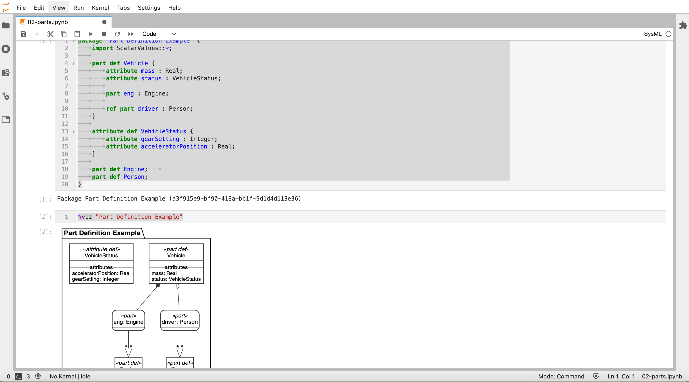

# Sysmlv2 Learning

## SysML V2

https://github.com/Systems-Modeling/SysML-v2-Release

1. Install 
    - [jupyter](https://github.com/Systems-Modeling/SysML-v2-Release/tree/master/install/jupyter)

2. Specification
   - [intro to textual notation](https://github.com/Systems-Modeling/SysML-v2-Release/blob/master/doc/Intro%20to%20the%20SysML%20v2%20Language-Textual%20Notation.pdf)
   - [intro to graphical notation](https://github.com/Systems-Modeling/SysML-v2-Release/blob/master/doc/Intro%20to%20the%20SysML%20v2%20Language-Textual%20Notation.pdf)
   - [examples](https://github.com/Systems-Modeling/SysML-v2-Release/tree/master/sysml/src)

## Tool Implementation

https://github.com/Systems-Modeling/SysML-v2-Pilot-Implementation